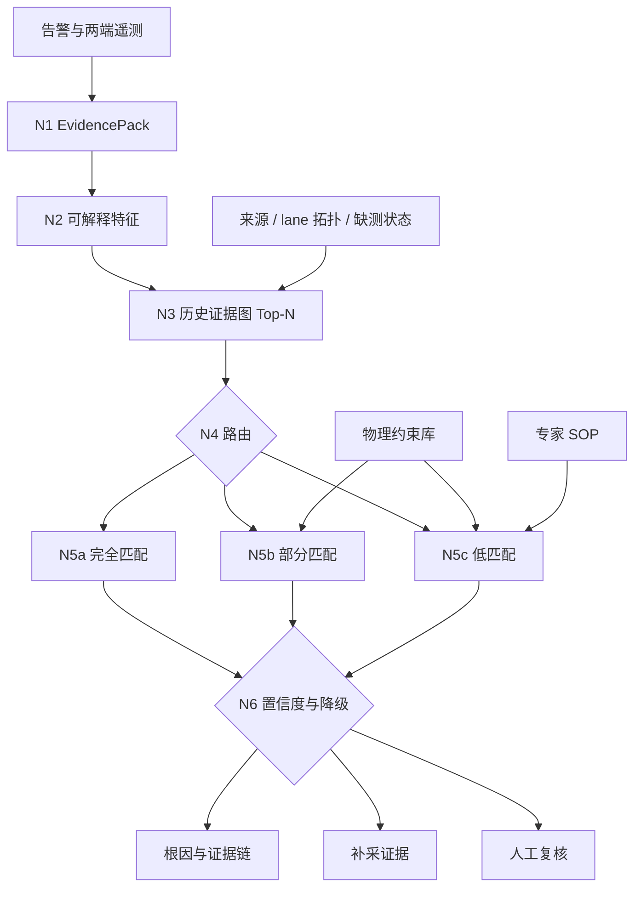

# nsdi-agent 项目章程与开发规范

本文定义 `nsdi-agent/` 的项目目标、活动数据契约、系统架构、开发边界和实验门禁。所有代码、数据准备和实验工作均以本文为准。

配套文档：

- `Progress.md`：当前可交付状态、已验证事实、资产清单和实施路线。
- `Validation.md`：进入正式实验前必须满足的验收规范。
- `docs/个人整体思路.md`：证据图 RCA 主链路的设计依据。

## 1. 项目背景

本项目面向光链路故障根因分析。输入是一条故障 case 的告警上下文、两端光模块遥测、lane 级测量和设备信息；输出是根因端点、关键证据链、置信度以及必要的补采或人工介入建议。

项目不把任务简化为无条件三分类。主方法以历史证据图匹配为入口，结合物理约束与专家 SOP，对证据充分度和历史模式覆盖进行显式判断。无法安全归因的 case 必须降级，不使用多数类先验伪装成高置信结论。

## 2. 活动数据契约

活动数据集固定为：

`datasets/filtered_rule_temporal_2025_06_09_v1/`

两个来源共同组成训练池，测试时保持来源隔离：

| 划分 | 来源 | L1 | L2 | fiber | 合计 |
| --- | --- | ---: | ---: | ---: | ---: |
| train | 两个来源合并 | 50 | 63 | 11 | 124 |
| test | `all_data` | 144 | 258 | 15 | 417 |
| test | `rule1_channel_not_4` | 37 | 29 | 1 | 67 |

时间切分规则：

- 训练集：告警月份为 2025-06、2025-07、2025-08、2025-09。
- 测试集：其余月份。
- 训练集允许合并建模。
- 两个测试集必须分别报告，不得合并成单一测试指标。

### 2.1 统一标签语义

正式标签空间只有三类：

- `L1`：本端根因。
- `L2`：对端根因。
- `fiber`：两端之间的光纤或链路介质根因。

来源别名映射固定为：

| 来源 | 原始端点 | 统一端点 |
| --- | --- | --- |
| `all_data` | `l1` | `L1` |
| `all_data` | `l2` | `L2` |
| `rule1_channel_not_4` | `l3` | `L1` |
| `rule1_channel_not_4` | `l4` | `L2` |
| 两个来源 | `fiber` | `fiber` |

`L1/L2` 表示本端/对端，不表示全局固定速率。来源拓扑固定为：`all_data` 的
L1=400G、L2=200G、光学 4×4；`rule1_channel_not_4` 的 L1/L2 均为 400G、光学 8×8。
Prompt 和规则必须从 case 拓扑上下文读取这些属性，不能把速率写进根因标签定义。

数据准备同时规范化遥测字典的端点键，例如 `l3-l4` 转换为 `L1-L2`。标签规范化只依据上述来源别名，不依据目录名、告警所在端或字段缺失情况推断。

### 2.2 来源与拓扑信息

统一标签不消除来源拓扑差异。每条 case 必须保留：

- `source_dataset`
- 原始标签
- 原始端点别名
- 原始文件路径与哈希
- 实际观测到的 lane 宽度
- 字段缺失状态

训练过程可以共享样本，但特征、检索、阈值和报告必须能够按来源或拓扑分层审计。
数据中的 `transmission` 字段验证了两端同编号光学 lane 的逻辑配对契约；允许沉淀同编号
lane 的掉光状态、影响范围和 case 内相对异常。禁止从原始 Tx/Rx 数值计算绝对链路损耗，
禁止把 4 条 SerDes lane 强制映射到 8 条光学 lane。

### 2.3 Expert label

`expert_label_annotations.json` 作为版本化人工裁决输入。当前数据通过核心遥测精确指纹匹配到 49 条审核 case，其中 27 条发生标签修正。

应用规则：

- 只对精确指纹命中的 case 应用人工标签。
- 不使用近邻或目录信息推断人工标签。
- 原标签、人工标签、匹配 case ID 和审核状态必须保留在审计文件中。
- 测试标签不得回灌训练知识、阈值、SOP 或证据图。

## 3. 系统目标

系统主链路为：

1. N1：case 标准化并构建 `EvidencePack`。
2. N2：抽取带物理语义的稀疏特征与缺测状态。
3. N3：在训练历史证据图中执行 Top-N 匹配。
4. N4：根据相似度、签名纯度、证据覆盖和拓扑兼容性进行路由。
5. N5a：完全匹配且历史签名纯净时，复用历史证据链并由 LLM 独立校验。
6. N5b：部分匹配时，使用物理约束判断缺失证据是否关键，再由 LLM 仲裁。
7. N5c：低匹配时，按照专家 SOP 进行约束内推理并生成补采项。
8. N6：依据可校准置信度输出结论、补采或人工复核。
9. N7：生成包含证据链、候选、冲突和路由来源的报告。

当前阶段冻结 N8 自动回灌。只有独立人工确认的 case 才能进入后续证据图版本，测试集推理结果只能写入实验 artifact。



## 4. 设计原则

### 4.1 证据图是主干

历史 case 检索、证据覆盖、缺失证据和冲突证据共同决定路由。数值决策树、专家方向规则、类别先验和 LLM 输出均不能替代证据图匹配主干。

### 4.2 标签隔离

`EvidencePack.from_case` 是推理数据入口。标签必须在该边界被结构性剥离。任何特征抽取、图构建、约束检查和 prompt 构建不得读取测试标签。

### 4.3 物理关系与统计知识分层

- 物理约束库存放单位、量测契约、器件关系、确定性排除条件和可验证方向关系。
- 训练集分位数、命中率、类别分布、Wilson 下界和决策树留在统计模型层。
- 统计相关性不得改写为确定性物理规律。

### 4.4 缺测是一等信息

`missing`、`not_applicable`、`invalid`、`observed` 必须区分。缺测不等于正常，也不等于异常。不同来源和月份的 schema 漂移必须进入报告与路由。

### 4.5 lane 数量无关化

跨 lane 特征优先使用比例、分位数、极差、最大异常程度和有效 lane 覆盖率。固定“任一 lane 异常”规则必须按 lane 数校准。跨端 lane 配对只有在物理编号映射明确时启用。

### 4.6 低置信度降级

证据冲突、历史签名混合、拓扑不兼容、关键字段缺失和校准支持不足均可触发补采或人工复核。系统不得为了覆盖率强制输出三分类。

## 5. 活动实现与参考资产

活动实现位于：

```text
rca_framework/
  evidence_pack.py
  features/
  evidence_graph/
  constraints/
  branches/
  llm/
  decision.py
  report.py
scripts/
tests/
experiments/
```

`organized_data`、`datasets/rca_v2_l2fixed` 及其 artifacts 是回归和方法参考资产，不是活动数据集。不同数据契约的指标不得直接横向比较，也不得复用训练拟合阈值、IDF、learned SOP 或置信度标定。

可复用的工程能力包括：

- `EvidencePack` 标签隔离与缺测建模。
- 可解释特征字典和特征抽取框架。
- IDF/Jaccard Top-N 检索结构。
- N5a/N5b/N5c 分支框架。
- 物理约束检查、LLM 协议、置信度降级和 HTML 报告骨架。

必须基于活动训练集重新生成的内容包括：

- 特征统计阈值和缺测基线。
- 证据图、IDF 和签名纯度。
- learned SOP 与训练统计先验。
- N4 路由阈值和 N6 置信度校准。
- measured constraints 的支持数和置信下界。

## 6. 开发边界

以下兼容项必须保持稳定：

- `ROOT_CAUSES` 的元素和顺序。
- 脱敏算法。
- legacy `model.json` schema。
- legacy CLI 的默认行为。
- `fusion.fuse_results`、legacy prompt 协议和已有回归测试。

活动数据适配通过新入口、adapter 或版本化 schema 实现，不修改旧入口语义。

禁止事项：

- 不在数据准备阶段运行模型或使用测试标签拟合参数。
- 不合并两个测试集报告主指标。
- 不把来源名称或 lane 数编码成根因标签。
- 不使用测试 bad case 修改训练知识包。
- 不把 learned SOP 描述为专家 SOP。
- 不把多数类先验作为默认最终候选。
- 不逐 case 手写 prompt。
- 不在缺少版本号和 manifest hash 时发布实验结果。
- 不修改或删除任务范围外的工作树内容。

## 7. 实施顺序

活动数据上的完整框架按以下顺序维护：

1. 运行数据完整性检查并确认 manifest hash。
2. 从 124 条训练 case 构建并持久化活动知识包。
3. 重新加载只读知识包，对两个来源测试集独立运行。
4. 审核两个 HTML 报告、bad case、fiber 个案和跨拓扑兜底。
5. 在训练边界内调整阈值并开展消融，不用测试结果回写同轮知识。

任何步骤均不得绕过 `Validation.md` 中对应门禁。

## 8. 实验规范

每次正式实验存放在：

`experiments/<YYYYMMDD>_<short-name>/`

必须包含：

- `experiment_manifest.json`
- `run_manifest.json`
- `summary.json`
- `predictions.json`
- `case_analysis.json`
- `bad_cases.json`
- `label_suspects.json`
- `irreducible_cases.json`
- `report.html`

`run_manifest.json` 至少记录：

- 数据 manifest hash
- train/test case 数与来源分布
- 特征字典版本与 hash
- 证据图版本
- 约束库版本
- SOP 版本
- prompt hash
- Top-N、路由阈值和置信度策略
- 随机种子
- LLM checkpoint 与推理参数
- N8 冻结状态

指标必须按两个测试集分别报告：

- accuracy 与 macro-F1
- 每类 precision/recall/F1
- fiber 指标
- coverage
- precision at coverage
- request-evidence 比例
- human-review 比例
- N5a 签名纯度和混合标签覆盖
- N5a/N5b/N5c 分支数量与表现
- 跨来源 Top-N 比例
- 缺测和拓扑不兼容触发数量

## 9. 验证命令

数据契约：

```bash
python3 scripts/prepare_filtered_rule_temporal_split.py --check
```

代码回归：

```bash
python -m pytest -q
```

修改约束、SOP 或 skill 渲染源后：

```bash
python scripts/render_rca_skills.py
```

正式 GPU 运行必须保存运行前后 `nvidia-smi`，并在进程外复核显存释放。

正式实验入口为 `scripts/run_filtered_rule_temporal_gpu_experiment.sh`。实验机自动同步入口为
`scripts/run_synced_filtered_rule_experiment.sh`：只允许干净工作树，固定切换并拉取 `main`，
成功后只提交本轮 artifact 并推送到 `main`。正式入口不使用 CPU 模型 dry run。

## 10. 文档维护

交付状态写入 `Progress.md`，验收条件写入 `Validation.md`，长期工程约束写入本文。三份文档共同构成完整、独立且一致的项目交付说明。

完成代码、数据或实验交付时：

1. 更新 `Progress.md` 的当前状态、实测数字和下一步。
2. 更新 `Validation.md` 对应门禁的状态与证据。
3. 保持活动数据契约、标签语义和实验边界在三份文档中一致。
