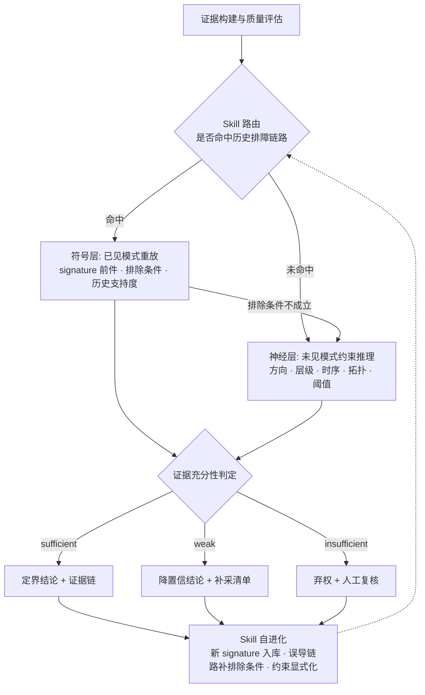

# nsdi-agent 开发说明

本文件是 `nsdi-agent/` 的项目级开发约束。任何后续 AI 或人工开发在修改代码前，必须先阅读本文件和 `Progress.md`。

## 1. 项目定位

`nsdi-agent/` 是 `/home/chenziang/nsdi/` 的 Skill 化 / Agent 化重构树，用于把当前光链路 RCA v2 从固定直线流水线改造成一个可控、可追踪、可弃权、可自进化的诊断系统。

当前正式标签仍然只有三类：

- `L1`：400G 端口或其设备侧根因。
- `L2`：200G 端口或其设备侧根因。
- `fiber`：L1 与 L2 之间的光纤 / 链路介质根因。

本项目的核心目标不是继续堆叠 prompt 或融合权重来提高 100% 覆盖率下的强制三分类 accuracy。现有证据表明，当前可用特征空间本身接近天花板：organized 60/40 DeepSeek-32B vLLM 为 59/85（69.41%），全特征 RandomForest 5 折天花板约 70.14%，且 fiber precision / recall / F1 仍为 0。

因此，Agent 化的贡献应定义为：

1. 从强制三分类转向证据充分性判定。
2. 在证据不足时主动请求新证据或显式弃权。
3. 区分同源一致与独立互证，避免把同一批 anomaly 的重复使用解释成双路确认。
4. 把人工确认后的排障经验沉淀为可版本化 Skill，使历史排障链路持续扩张。

## 2. 与 `nsdi/` 的差别

`/home/chenziang/nsdi/` 是只读参照树，用于保存当前 v2 基线、历史探索和实验记录。`/home/chenziang/nsdi-agent/` 是唯一活动开发树，后续 Skill 化 / Agent 化代码都应在这里完成。

开发时遵守以下边界：

- 不在 `nsdi/` 中修改代码、脚本、数据或 artifacts。
- 不让 `nsdi-agent/` 的脚本默认写入 `nsdi/`。如需读取历史实验或归档，只能显式只读引用。
- 不把 `nsdi/before/` 的旧探索代码混入 v2 主路径，除非明确作为对照基线引用。
- 不把 `nsdi/artifacts/layered_injection_20260805/` 当作活动实现维护；它只保留实验结果与回放价值。

本仓库是按轻量复制策略初始化的，并非 `nsdi/` 的全量镜像。

已复制：

- `rca_framework/`
- `docs/`
- `datasets/`
- `organized_data/`
- `tests/`
- `scripts/`
- `archive/`
- `pytest.ini`
- `README.md`
- `70.json`
- `artifacts/organized_rca_v2_60_40_seed42_baseline/`
- `artifacts/organized_rca_v2_60_40_seed42_deepseek32b_vllm/`

未复制：

- `before/`：旧探索代码、旧报告、旧 outputs 和 saved_methods，约 25M。
- 其余历史 artifacts，包括 `artifacts/layered_injection_20260805/`，约 40M。
- 缓存目录，如 `__pycache__/`、`.pytest_cache/`。

如后续确需查看未复制内容，从 `/home/chenziang/nsdi/` 只读引用，不要复制回活动树形成两份漂移实现。

## 3. Agent 化叙事

本项目采用“已见模式 / 半见模式 / 未见模式”的诊断分工，替代原来的“神经层和符号层并列分类器”叙事。

| 模式 | 对应覆盖状态 | 主责能力 | 输出倾向 |
| --- | --- | --- | --- |
| 已见模式 | `covered_pair` / `covered_exemplar` | 符号层：历史排障链路重放 | 定界结论 + 可审计证据链 |
| 半见模式 | `covered_singleton` / `partial` | 符号层给弱候选，神经层做约束筛选 | 降置信结论、补证据或弃权 |
| 未见模式 | `uncovered` / `prior_only` | 神经层：多层次约束推理 | 约束内候选 + 补采清单，或弃权 |

符号层不是另一个黑盒分类器，而是历史排障链路的结构化重放。它回答的问题是：当前 case 是否命中已有 signature，排除条件是否成立，历史支持度是否足以支撑定界。

神经层不是在无约束地猜 L1 / L2 / fiber，而是在历史链路给不出充足证据时，基于方向、层级、时序、拓扑、阈值和证据质量等多层次约束进行分析判断。未见模式下如果这些约束仍无法区分候选，正确出口是补证据或弃权，而不是多数类猜测。



### 3.1 目标目录结构

最终目标不是一次性重写所有代码，而是在保持 legacy 回归可复现的前提下逐步引入以下结构：

```text
rca_framework/
  agent/
    protocol.py      # AgentAction / ToolCall / ToolResult / Verdict
    tools.py         # 无状态工具注册与包装
    sufficiency.py   # 证据充分性门控
    policy.py        # decide / request_evidence / abstain
    loop.py          # Plan -> Call -> Check -> Decide 控制循环
    trace.py         # JSONL trace 写入与回放
    playbook.py      # rca-playbook signature 匹配与回退
  llm/
    __init__.py
    backend.py
    prompts.py
    protocol.py
  retrieval.py
  evidence.py
skills/
  rca-domain/SKILL.md
  rca-workflow/SKILL.md
  rca-playbook/
    SKILL.md
    cases/*.md
```

### 3.2 Skill 自进化

反馈学习不再描述为“把样本回灌训练集”这一条路，而是描述为 Skill 自进化：

1. 未见模式经人工确认后，抽取必要证据、排除条件、处置动作，新增 Case Skill，使该模式下一次变成已见模式。
2. 已见模式命中但误导时，优先补充排除条件，而不是直接删除历史链路。
3. 神经层反复使用但未被显式编码的约束，经专家审核后沉淀为 Common Guidance 或 KG / rule 约束。
4. 所有 Skill 发布必须有版本号，并写入 `run_manifest.json`，否则不同版本结果不可比较。

## 4. 初始仓库事实

复制初始化时，活动代码位于 `rca_framework/`，合计 1919 行：

| 文件 | 行数 | 初始职责 |
| --- | ---: | --- |
| `rca_framework/data.py` | 332 | 数据清单、脱敏、L1/L2 归一化、数据集加载 |
| `rca_framework/anomaly.py` | 262 | 阈值拟合、异常提取、方向性损耗 |
| `rca_framework/graph.py` | 334 | label-centered anomaly KG、路径评分、feature rules、RAG 检索 |
| `rca_framework/rules.py` | 182 | 互斥符号规则学习与匹配 |
| `rca_framework/llm.py` | 218 | KG/RAG prompt、schema、解析、LLM 后端、LLM 路打分 |
| `rca_framework/fusion.py` | 100 | 两路加权融合、冲突仲裁、证据整理 |
| `rca_framework/pipeline.py` | 233 | fit / infer / evaluate / save / load、reasoner 缓存 |
| `rca_framework/cli.py` | 169 | `prepare` / `train-evaluate` / `infer` 入口 |
| `rca_framework/types.py` | 84 | 基础类型、`ROOT_CAUSES`、分数归一化与排序 |
| `rca_framework/__init__.py` | 5 | 包初始化 |

测试初始状态：

- `tests/test_data_pipeline.py`：2 个测试。
- `tests/test_graph_rules.py`：2 个测试。
- `tests/test_pipeline_and_fusion.py`：3 个测试。
- 合计 7 个测试，168 行。

可靠基线：

| 基线 | 结果 | 备注 |
| --- | --- | --- |
| organized 60/40 deterministic baseline | 58/85，accuracy 68.24% | `backend=none`，`fiber` recall 0 |
| organized 60/40 DeepSeek-32B vLLM | 59/85，accuracy 69.41% | 85 条有效 LLM 输出，`fiber` recall 0 |
| 同一测试集多数类基线 | 55/85，accuracy 64.71% | L2 majority |
| 全特征 RandomForest 5 折天花板 | 约 70.14% | `fiber` precision / recall / F1 均为 0 |

已知边界：

- 21/85 测试 case 提取零异常并回退到 L2 先验。
- `directional_loss` 与 `bidirectional_loss` 在现有 artifacts 中没有触发。
- `bias`、`Temperature`、`Voltage`、`alarm_name`、`vendor` 没有表现出稳定可用的类别分离。
- `fiber` 在 `organized_data` 中只有 14 条有效 case，60/40 切分下训练集只有 8 条。
- 当前系统不应被描述为解决了 fiber RCA；它只是略高于 L2 多数类基线。

## 5. 开发铁律

### 5.1 必须冻结

除非用户明确要求破坏兼容并重建全部 artifacts，否则不要修改：

- `ROOT_CAUSES` 的元素和顺序。
- `anomaly_id` 字符串格式。
- `model.json` 的现有 schema。
- 脱敏算法与 L1/L2 归一化规则。
- `fusion.fuse_results` 的 legacy 行为。
- `build_path_prompt` 与 `LLM_OUTPUT_SCHEMA` 的 legacy 协议。
- `scripts/run_main_experiment.sh` 的回归命令语义，除非是目录迁移所需路径修正。

### 5.2 硬门禁

任何阶段只要声称 legacy 兼容，都必须满足：

```bash
python -m rca_framework.cli train-evaluate \
  --data-dir datasets/organized_rca_v2_stratified_60_40_seed42 \
  --train-size 126 \
  --output-dir artifacts/<run-name> \
  --backend none
```

结果必须保持：

- `case_count == 85`
- `correct == 58`
- `accuracy == 0.6823529411764706`
- `fiber` recall 为 0
- 逐 case prediction 与 `artifacts/organized_rca_v2_60_40_seed42_baseline/predictions.json` 一致
- `label_leakage == false`

从阶段 0 起，上述门禁已由 `tests/test_baseline_lock.py` 自动化，`python -m pytest -q` 即可复核。该测试失败一律视为 legacy 行为漂移，不允许通过修改断言来消除。

阶段 0 同时固定了 `idf` 键序与检索的浮点求和顺序，因此同一份数据在任意 `PYTHONHASHSEED` 下都会产出字节一致的 artifacts。基线目录 `model/model.json` 是修正前生成的，`idf` 键序与新产物不同，但两者数值与 schema 完全一致，比对模型文件时按 JSON 结构比而不是按字节比。

有 GPU 与本地模型时，DeepSeek-32B vLLM legacy 基线应保持 59/85，但无 GPU 环境下该项可以延后。

### 5.3 不做清单

- 不做多 Agent 编排。只做一个协同 Agent 加一组神经 / 符号工具。
- 不重命名 `L1`、`L2`、`fiber`。
- 不重新生成数据集作为默认动作。
- 不删除 `fusion.fuse_results`，它是 58/85 与 59/85 的回归锚点。
- 不把同源一致解释为独立互证。
- 不承诺靠 prompt 或 LLM 单独解决 fiber。
- 不把 `before/` 或归档快照变成第二套活动实现。

## 6. 推荐开发顺序

严格遵循 `Progress.md` 的阶段指针。当前正确顺序是：

1. 阶段 0：`RuntimeConfig`、`build_case_context` 去重、基线锁定测试。
2. 阶段 1：只增加观测字段和证据结构，不改变 legacy 数值。
3. 阶段 2：lane 级证据只以影子模式运行，先报触发数。
4. 阶段 3：新增确定性 Agent 控制流，默认仍走 legacy。
5. 阶段 4：拆分 LLM 子包、引入 `abstain`、切换到选择性评估。
6. 阶段 5：建立 `skills/` 与 trace 回放驱动的 Skill 自进化。

每次完成代码变更后，更新 `Progress.md` 的模块状态、阶段状态、门禁结果和变更日志。
