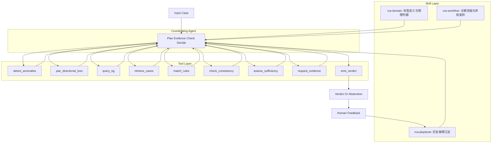

# NSDI 光链路 RCA Agent 化探索方案

本文给出探索方案设计，不实现 Agent 代码。目标是把当前“KG + RAG + LLM + 符号规则 + 融合”的多模块流水线，重构为“一个协同 Agent + 一组神经/符号工具 + 可沉淀的 Skill 知识库”的诊断流程。

## 设计动机

当前 RCA v2 的主要问题不是模块不够多，而是所有模块最终都在同一份单点故障快照上做强制三分类。缺陷分析已经表明：

- 多数类基线 64.71%，当前最佳 69.41%，净收益有限。
- 全特征 RandomForest 约 70.14%，`fiber` 仍为 0。
- 21/85 测试 case 没有提取到任何异常，却仍被强制输出一个标签。
- `missing_information` 只进入结果 JSON，不进入控制流。

因此 Agent 化不是为了“把 LLM 放在最后再猜一次”，而是为了把 RCA 从一次性分类器改造成诊断流程：

1. 先判断证据是否足够。
2. 不足时主动请求新证据或输出弃权。
3. 有证据冲突时调用工具解释冲突。
4. 人工确认后把经验沉淀为 Skill。

## 总体架构



架构原则：

- 只有一个 Agent 负责协同。不要再做“一个神经 Agent + 一个符号 Agent + 一个融合 Agent”的多 Agent 编排。
- 神经和符号能力都包装成工具，由 Agent 按需调用。
- Skill 不是代码模块，而是可读、可版本化的知识载体。
- Agent 输出可以是 `L1`、`L2`、`fiber`，也可以是 `abstain`。

## Agent 职责

协同 Agent 的职责不是直接替代分类器，而是管理诊断控制流。

### 输入

```json
{
  "case": "schema-v2 case json",
  "model": "optional fitted RCA model path",
  "context": {
    "available_evidence": ["lane snapshot", "status flags"],
    "operator_goal": "predict | explain | request_more_evidence"
  }
}
```

### 输出

```json
{
  "decision": "L1 | L2 | fiber | abstain",
  "confidence": 0.0,
  "evidence_sufficiency": "sufficient | weak | insufficient",
  "supporting_evidence": [],
  "conflicting_evidence": [],
  "requested_evidence": [],
  "playbook_matches": [],
  "reasoning_trace": []
}
```

### 控制流

1. 读取 `rca-domain`，确认标签定义和物理约束。
2. 调用 `detect_anomalies` 和 `pair_directional_loss`，生成基础证据。
3. 调用 `assess_sufficiency` 判断证据是否足够。
4. 证据不足时调用 `request_evidence`，直接输出补证据清单或 `abstain`。
5. 证据足够时调用 `query_kg`、`retrieve_cases`、`match_rules`。
6. 调用 `check_consistency` 检查工具结果是否互相支持。
7. 如果一致且证据充分，调用 `emit_verdict` 输出标签。
8. 如果冲突且无法消解，输出 `abstain` 和人工复核理由。
9. 人工反馈真因后，更新 `rca-playbook`。

## 工具层设计

工具应保持无状态、可复现、可单测。当前 `rca_framework/` 中的大部分能力可以直接被工具包装，不需要重写。

### `detect_anomalies`

用途：复用 `extract_evidence()`，把输入 case 转成异常节点集合。

输入：

```json
{
  "case": {},
  "threshold_model": {}
}
```

输出：

```json
{
  "anomalies": [],
  "missing_fields": [],
  "coverage": 0.0
}
```

注意：该工具保留现有行为，但 Agent 必须知道其局限：阈值来自故障样本而非健康基线，零异常不等于无故障。

### `pair_directional_loss`

用途：以 lane 为单位计算 `L1_to_L2` 和 `L2_to_L1` 的方向性损耗，保留每条 lane 的 tx/rx 对齐证据。

输入：

```json
{
  "case": {},
  "side_mapping": {"L1": "local | remote", "L2": "local | remote"}
}
```

输出：

```json
{
  "directions": {
    "L1_to_L2": [{"lane": "0", "tx": 0.0, "rx": 0.0, "loss": 0.0}],
    "L2_to_L1": [{"lane": "0", "tx": 0.0, "rx": 0.0, "loss": 0.0}]
  },
  "signatures": {
    "tx_ok_rx_down": [],
    "bidirectional_same_lane": [],
    "tx_down": []
  }
}
```

定位：这是当前代码最缺失的物理证据工具。但文档必须写清楚，它不是 `fiber` 的强分类器，只是证据之一。

### `query_kg`

用途：复用 `AnomalyKnowledgeGraph.query()`，根据异常节点返回 KG 路径、候选分数和 feature rule 匹配。

输出中必须保留：

- `scores`
- `paths`
- `matched_feature_rules`
- `evidence_coverage`
- `path_count`

Agent 使用方式：KG 输出是候选证据，不是最终答案。

### `retrieve_cases`

用途：复用 KG 内部 RAG 检索逻辑，寻找训练集中异常重叠 case。

输出：

```json
{
  "retrieved_cases": [
    {
      "case_id": "",
      "root_cause": "L1 | L2 | fiber",
      "similarity": 0.0,
      "overlap_anomalies": [],
      "supporting_evidence": []
    }
  ]
}
```

Agent 使用方式：检索结果只作为类比证据。若相似度低或只命中多数类样本，应降低可信度。

### `match_rules`

用途：复用 `SymbolicRuleEngine.match()`，输出三类符号规则匹配结果。

输出：

```json
{
  "prediction": "L1 | L2 | fiber",
  "scores": {},
  "matched_rules": {},
  "rule_coverage": 0.0
}
```

Agent 使用方式：对 `fiber` 的 `n=2` 规则必须标注为低样本支持，不得等同于高置信专家规则。

### `check_consistency`

用途：检查不同工具是否互相支持，避免同源证据被误解为多路独立证据。

输入：

```json
{
  "kg_result": {},
  "rule_result": {},
  "directional_result": {},
  "retrieval_result": {}
}
```

输出：

```json
{
  "status": "consistent | conflicting | same_source_agreement",
  "conflicts": [],
  "shared_evidence": [],
  "independent_evidence_count": 0
}
```

关键判断：

- KG 和符号规则若都来自同一组 anomaly id，应标为 `same_source_agreement`，不能当作独立确认。
- 只有来自不同证据源的支持才增加独立证据数。

### `assess_sufficiency`

用途：判断当前证据是否足以输出三分类。

输入：

```json
{
  "anomalies": [],
  "directional_signatures": {},
  "kg_result": {},
  "rule_result": {},
  "retrieval_result": {},
  "coverage": 0.0
}
```

输出：

```json
{
  "sufficiency": "sufficient | weak | insufficient",
  "blocking_reasons": [],
  "recommended_action": "decide | request_evidence | abstain"
}
```

建议门限：

- 零异常：`insufficient`
- 只有多数类先验证据：`insufficient`
- KG 与规则一致但同源：最多 `weak`
- `fiber` 候选仅由 `n<=2` 训练规则支持：最多 `weak`
- 存在逐 lane 方向证据但 L1/L2 也有同类模式：需要额外证据，不应直接判 `fiber`

### `request_evidence`

用途：把证据缺口转成工程可执行的补采清单。

输出：

```json
{
  "requested_evidence": [
    {
      "name": "OTDR trace",
      "reason": "distinguish fiber medium fault from endpoint RX fault",
      "priority": "high",
      "expected_effect": "confirm or reject fiber root cause"
    }
  ]
}
```

优先请求：

- OTDR 或链路衰减测试。
- 发端与收端光功率时序，而不是单点快照。
- FEC 误码、CRC、lane flap 时间序列。
- 同链路历史工单和近邻链路共因故障。
- 光纤长度、跳纤、ODF、链路预算。
- 设备侧端口复位、模块更换、交叉验证记录。

### `emit_verdict`

用途：统一输出最终结果或弃权。

输出要求：

- 必须明确 `decision` 是标签还是 `abstain`。
- 必须列出支持证据和反证。
- 必须列出是否依赖多数类先验。
- 必须列出人工复核建议。

## Skill 层设计

Skill 负责保存 Agent 需要长期记住的知识。建议分三类。

### `rca-domain`

内容：

- `L1`、`L2`、`fiber` 的物理定义。
- 400G/200G 侧规范化规则。
- 关键指标单位与正常范围。
- 断光哨兵值和 lane 对齐规则。
- 不应使用的伪证据和弱证据。

价值：避免 Agent 每次重新从代码中猜测领域定义。

### `rca-workflow`

内容：

- 标准诊断流程。
- 证据充分性门限。
- 什么时候可以三分类。
- 什么时候必须弃权。
- 缺失信息到补采动作的映射。

价值：把“强制分类”改成“诊断流程”。

### `rca-playbook`

内容结构：

```markdown
# [故障模式名称]

## Signature
- 观测模式
- 必要证据
- 排除条件

## Decision
- 推荐标签
- 置信度
- 适用边界

## Action
- 建议补采
- 建议处置

## Evidence Source
- 工单或 case id
- 人工确认人
- 更新时间
```

价值：用历史故障沉淀替代小样本统计。对 `fiber` 尤其重要，因为当前训练样本只有 8 条。

## 历史故障沉淀流程


每次人工确认后，不直接把 case 丢进训练集，而是先沉淀为可审计 playbook：

1. 记录原始观测。
2. 标注最终真因。
3. 提取必要证据和排除条件。
4. 写入 `rca-playbook`。
5. 后续 Agent 调用 playbook 作为专家知识。

这样可以避免 8 条 `fiber` 样本被统计模型过拟合，同时保留可解释的经验。

## 双轨运行时

### 论文与复现实验轨

目标：可复现、可记录、可写进论文。

建议技术栈：

- Python Agent Loop。
- `/home/chenziang/miniconda3/envs/logsy/bin/python`。
- 本地 `DeepSeek-R1-Distill-Qwen-32B`。
- vLLM structured output 或 function calling。
- Tool 调用记录写入 JSONL trace。

该轨道输出：

- 每个 case 的 tool trace。
- 每个 decision 的证据充分性判断。
- 每次 abstention 的原因。
- 每次 evidence request 的结构化清单。

### Cursor 交互轨

目标：快速演示与人工协作。

建议技术栈：

- Cursor Skill 读取 `rca-domain`、`rca-workflow`、`rca-playbook`。
- Agent 在 IDE 中读取 case、调用脚本、生成解释报告。
- 人工反馈后更新 playbook 文档。

该轨道不作为论文核心指标来源，但适合展示人机协同过程。

## 评估协议

当前单一 accuracy 会掩盖证据不足问题。建议改为四类指标。

### 覆盖率-精度曲线

Agent 可以输出 `abstain`。报告：

```text
coverage = 输出标签的样本数 / 总样本数
precision_at_coverage = 输出标签样本中的准确率
```

示例目标：

- coverage 100% 时，必须对比当前 69.41%。
- coverage 80% 时，观察是否能显著提高精度。
- coverage 60% 时，观察是否能达到可运维使用的高可信结果。

### 证据请求质量

人工评估 `request_evidence` 是否可执行：

- 请求是否具体。
- 请求是否能区分候选根因。
- 请求是否按成本和收益排序。
- 请求是否避免无用字段。

### `fiber` 专项指标

不要只看三分类 accuracy。单独报告：

- `fiber` recall。
- `fiber` precision。
- `fiber` evidence sufficiency rate。
- `fiber` abstention rate。

如果证据不足，`fiber` abstention 比错误判成 `L1`/`L2` 更可接受。

### Playbook 增益

比较无 playbook 与有 playbook 的结果：

- 命中历史故障模式的 case 数。
- playbook 命中后的准确率。
- playbook 误导的 case 数。
- 新增 playbook 条目的人工确认成本。

## 分阶段路线图

### 阶段一：离线分析版

目标：不改现有模型，只包工具和报告。

产物：

- 工具输入输出契约。
- 证据充分性规则。
- 缺陷分析文档。
- 覆盖率-精度评估脚本。

### 阶段二：Agent Loop 原型

目标：让 Agent 能按流程调用工具，但不追求指标提升。

产物：

- JSON tool trace。
- `abstain` 输出。
- `request_evidence` 输出。
- 单 case 诊断报告。

### 阶段三：历史故障沉淀

目标：建立 `rca-playbook`，把人工确认真因写成可复用 Skill。

产物：

- `rca-playbook/SKILL.md`。
- `cases/*.md`。
- playbook 命中统计。

### 阶段四：闭环评估

目标：证明 Agent 的价值不是盲目提高 accuracy，而是提高高置信覆盖范围和减少错误强判。

产物：

- 覆盖率-精度曲线。
- `fiber` 专项评估。
- evidence request 人工评分。
- playbook 前后对比。

## 风险边界

必须在论文或报告中诚实写明：

1. 在不引入新证据源的前提下，Agent 方案的 raw accuracy 大概率仍在 70% 附近。
2. `fiber` 的困难来自数据不可分和样本过少，不应承诺仅靠 LLM 解决。
3. Agent 的核心贡献应定义为诊断流程、证据充分性、主动补证据和历史知识沉淀。
4. 如果评估仍只看 100% 覆盖的三分类 accuracy，Agent 化的优势会被低估。

## 与当前框架图的对应关系

当前框架图中的神经层、符号层和协同模块可以重解释为：

- 神经能力：LLM reasoning、case summarization、evidence request generation。
- 符号能力：KG path、exclusive rules、lane-level physical signatures。
- 协同能力：统一收敛到一个 Agent 控制流。
- Skill：承载领域定义、流程准则和历史故障经验。
- Tools：承载可复现计算和检索。

这种改造能保留原图的知识驱动思想，同时避免把复杂性堆在多个同源分类器上。

融合后的统一框架图见 `docs/UNIFIED_AGENT_RCA_FRAMEWORK_CN.md`。

本文停在概念层。把这套设计落到具体文件的方案——每个模块改哪些函数、哪些数值逻辑必须冻结、
改造前与 Agent 化后的代码架构图、分阶段迁移与回归门禁——见
`docs/AGENT_REFACTOR_MODULE_STRATEGY_CN.md`。

## 最小可行演示

一个合理的 demo 不需要马上重训模型：

1. 输入一个 schema-v2 case。
2. Agent 调用 `detect_anomalies`。
3. Agent 调用 `pair_directional_loss`。
4. Agent 判断证据不足。
5. Agent 输出 `abstain` 和补证据清单。
6. 人工提供真因。
7. Agent 生成一条 playbook 草案。

这个 demo 比“再输出一个错误的 `L1`/`L2`/`fiber`”更符合运维场景，也更契合缺陷分析得出的事实。
