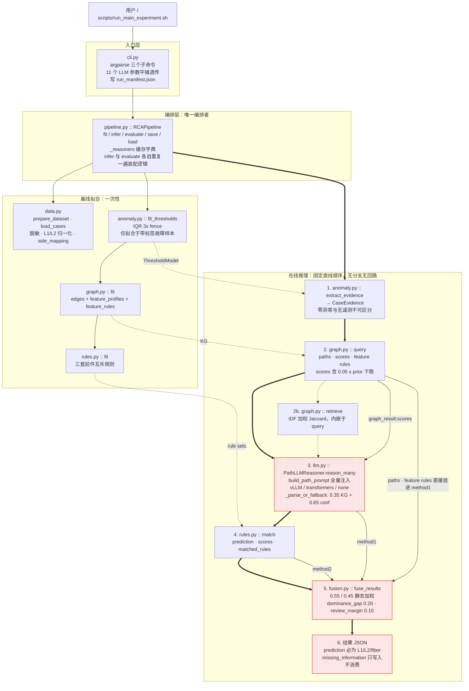
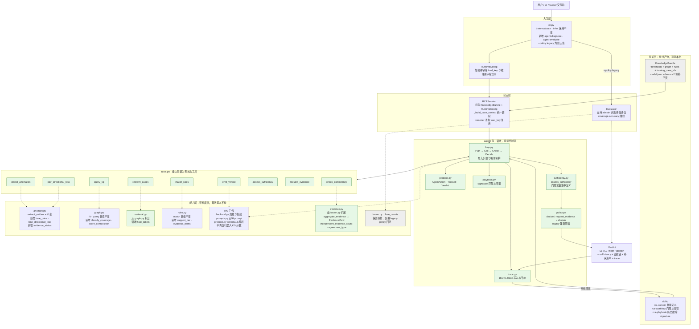

# RCA v2 Agent 化逐模块改造策略与架构图

## 1. 文档定位

本文是代码级改造方案，回答一个问题：**在已经回退到分层注入实验之前的代码基线上，把当前直线流水线改造成 Agent 化诊断系统，每个文件具体要改什么。**

与已有三份文档的分工：

| 文档 | 层次 | 内容 |
| --- | --- | --- |
| `docs/AGENT_RCA_DESIGN_CN.md` | 概念层 | Agent 职责、9 个工具的输入输出契约、Skill 分类、评估协议、路线图 |
| `docs/UNIFIED_AGENT_RCA_FRAMEWORK_CN.md` | 框架层 | 在线运行时 + 工具层 + 离线知识演化的统一框架图 |
| `docs/KG_INJECTION_ABLATION_DEEPSEEK32B_REPORT_CN.md` | 实验层 | 四组 DeepSeek-32B 消融的结论与边界 |
| **本文** | **代码层** | **逐文件现状、职责重划、函数级修改、兼容约束、回归门禁、迁移阶段** |

本文不重复概念论证。凡涉及"为什么要 Agent 化"，以缺陷分析和消融实验的既有结论为前提。

## 2. 前置动作：代码回退记录

改造策略基于回退后的代码，而不是分层注入实验版本。回退已完成。

### 2.1 回退内容

| 文件 | 回退动作 | 来源 |
| --- | --- | --- |
| `rca_framework/llm.py` | 整文件恢复 | `archive/rca_framework_snapshot_20260805_pre_layered_injection/` |
| `rca_framework/pipeline.py` | 整文件恢复 | 同上 |
| `rca_framework/cli.py` | 整文件恢复 | 同上 |
| `tests/test_kg_injection.py` | 移出活动代码树 | 已归档 |
| `scripts/run_injection_ablation.py` | 移出活动代码树 | 已归档 |
| `scripts/summarize_injection_ablation.py` | 移出活动代码树 | 已归档 |

未回退的一项：`scripts/fetch_model_modelscope.py` 保留在 `scripts/` 下。它是模型权重下载工具，与 RCA 运行时和本文讨论的架构没有耦合，删除只会增加复现成本。

`data.py`、`anomaly.py`、`graph.py`、`rules.py`、`fusion.py`、`types.py` 本次实验从未修改，因此无需回退。

### 2.2 归档位置

回退前的分层注入版本已完整归档，可随时取回：

```text
archive/rca_framework_snapshot_20260806_layered_injection/
  rca_framework/            # 10 个模块的分层注入版本
  tests/test_kg_injection.py
  scripts/run_injection_ablation.py
  scripts/summarize_injection_ablation.py
  run_main_experiment.sh
  layered_injection.diff    # 相对改造前基线的完整 unified diff，580 行
  SHA256SUMS.txt
```

实验产物 `artifacts/layered_injection_20260805/` 未动，四组消融结果仍可查。

### 2.3 回退验证

```text
pytest                     7 passed
确定性基线                  58/85，accuracy 68.24%
recall                     L1=45.83%  L2=85.45%  fiber=0
confusion matrix           L1:{L1:11,L2:13}  L2:{L2:47,L1:8}  fiber:{L1:4,L2:2}
decision_status            agreement 82，conflict_resolved_by_kg_rag_llm 3
```

与快照 README 记录的改造前基线（58/85、68.24%、fiber recall 0）逐项一致，回退无残留。

### 2.4 git 跟踪范围

仓库根位于 `/home/chenziang`（home 目录），此前 53 个顶层条目全部处于未跟踪状态。已通过 `/home/chenziang/.gitignore` 收缩为只跟踪 `nsdi/`，并排除 `__pycache__`、`.pytest_cache` 等缓存。当前仓库尚无任何提交。

## 3. 回退后的代码基线

### 3.1 模块清单

| 文件 | 行数 | 职责 | 被谁调用 |
| --- | ---: | --- | --- |
| `types.py` | 84 | `ROOT_CAUSES`、`Anomaly`、`CaseEvidence`、分数归一化与排序 | 全部模块 |
| `data.py` | 332 | 源清单、脱敏、L1/L2 归一化、数据集读写 | `cli.py` |
| `anomaly.py` | 262 | 阈值拟合、异常提取、方向性损耗 | `pipeline.py` |
| `graph.py` | 334 | KG 学习、路径评分、feature rule 学习、RAG 检索 | `pipeline.py` |
| `rules.py` | 182 | 互斥符号规则学习与匹配 | `pipeline.py` |
| `llm.py` | 218 | prompt 构造、输出 schema、解析、后端加载、LLM 路打分 | `pipeline.py` |
| `fusion.py` | 100 | 两路加权融合、冲突仲裁、证据整理 | `pipeline.py` |
| `pipeline.py` | 233 | 训练、单 case 推理、批量评估、模型存取、reasoner 缓存 | `cli.py` |
| `cli.py` | 169 | `prepare` / `train-evaluate` / `infer` 入口 | 用户 |

合计 1919 行。`data.py` 只在离线数据准备阶段调用，其余模块全部位于推理路径上。

### 3.2 改造前的代码架构图



红色标注的三个节点是 Agent 化必须动的位置：LLM 路打分、静态融合器、强制三分类出口。

### 3.3 这张图暴露的六个结构性约束

这些是架构问题，不是代码风格问题，逐条对应后面的模块改造。

**一、没有控制流。** `pipeline.infer()` 是一条 `extract → query → llm → match → fuse` 的直线。任何"先看证据够不够，再决定调用什么"的逻辑都无处安放，因为顺序在函数体里写死了。

**二、只有一个出口。** `fuse_results` 的返回值中 `prediction` 恒为 `L1/L2/fiber` 之一。`decision_status` 已经有 `manual_review_recommended`，但没有任何下游消费它，`cli.py` 只统计计数。弃权能力实际上是缺失的。

**三、LLM 不是决策者，是打分部件。** `_parse_or_fallback` 把 LLM 的 `prediction/confidence` 与 KG 分数按 0.35/0.65 混成一个三维向量，交给融合器。LLM 的推理内容除了这个向量之外不影响任何决策。

**四、双路一致性是结构性必然，不是独立确认。** `method1` 与 `method2` 都以同一组 `anomaly_id` 为唯一输入。更极端的是 `backend=none` 时 `_fallback` 直接返回 `graph_result` 的 prediction，此时"LLM 路"就是 KG 路本身。确定性基线里 82/85 是 `agreement`，这个数字不能读作"两路独立互证"。

**五、证据来源信息在进入融合器前就丢了。** `method1["scores"]` 与 `method2["scores"]` 都是 `Dict[str, float]`。融合器拿不到"这个分数由哪些 anomaly 支撑"，因此在数据结构层面就无法实现同源判定。

**六、"没有证据"被静默转换成了"先验"。** `graph.query` 的 `raw_scores` 以 `0.05 * priors[label]` 起步，`rules.match` 以 `0.02 * priors[label]` 起步。因此零异常 case 依然得到一个非空分数分布，且该分布等于训练集类别先验。消融实验已量化这一点：22 条 `uncovered` 中 21 条完全没有异常，却全部被强制分类。

## 4. Agent 化后的代码架构图



绿色为新增，灰色为冻结不动。核心变化是三条：

1. **编排职责从 `pipeline.py` 迁到 `agent/loop.py`。** `pipeline.py` 不再决定调用顺序，只负责装配上下文与复用模型。
2. **`fusion.py` 从决策者降级为回归基线。** 新的 `evidence.py` 只做证据聚合与同源识别，最终决策交给 `policy.py`。
3. **出口从一个变三个。** `Verdict.decision` 允许 `abstain`，并携带 `requested_evidence`。

## 5. 逐模块改造策略

每个模块按同一格式给出：现状与问题、Agent 化后角色、具体修改、冻结不动的部分、验收标准。

### 5.1 `types.py`：只增不改，补齐决策与证据类型

**现状。** 84 行，无内部依赖，定义 `ROOT_CAUSES`、`SIDES`、`Anomaly`、`CaseEvidence`、`normalize_scores`、`rank_scores`。所有模块都引用它，因此它是唯一可以安全放置跨模块新类型的地方。

**问题。** 缺两类类型。一是决策类型：现在没有任何地方能表达 `abstain`，`prediction` 只能是 `ROOT_CAUSES` 里的字符串。二是带来源的证据类型：分数一律用 `Dict[str, float]` 传递，`origin` 信息在函数返回时就丢弃了，这直接导致同源判定在数据结构层面不可能实现。

**Agent 化后角色。** 全系统的协议基座。Agent、工具、policy、trace 都用它交换数据。

**具体修改。** 追加以下定义，不动任何现有定义：

```python
DECISIONS: Tuple[str, ...] = ROOT_CAUSES + ("abstain",)
SUFFICIENCY: Tuple[str, ...] = ("sufficient", "weak", "insufficient")
EVIDENCE_SOURCES: Tuple[str, ...] = (
    "anomaly", "lane_loss", "kg_path", "kg_feature_rule",
    "symbolic_rule", "retrieval", "playbook",
)

@dataclass(frozen=True)
class EvidenceItem:
    evidence_id: str
    source: str                        # EVIDENCE_SOURCES 之一
    supports: str                      # L1 | L2 | fiber | none
    strength: float
    origin_anomalies: Tuple[str, ...]  # 同源判定的唯一依据
    is_prior_only: bool                # 该证据是否只反映训练集类别先验
    detail: Dict[str, Any]

@dataclass
class Verdict:
    decision: str                      # DECISIONS 之一
    confidence: float
    sufficiency: str                   # SUFFICIENCY 之一
    supporting: List[EvidenceItem]
    conflicting: List[EvidenceItem]
    requested_evidence: List[Dict[str, Any]]
    abstain_reason: str
    trace_id: str
```

`origin_anomalies` 是整个改造里性价比最高的一个字段。有了它，`check_consistency` 才能判断 KG 路与规则路是否共享同一批 `anomaly_id`；没有它，一致性只能靠比较 prediction，而那必然得到"一致"。

**冻结。** `ROOT_CAUSES` 的元素与顺序、`normalize_scores` 的零和退化行为、`rank_scores` 的 tie-break 规则。这三项被历史 artifacts 与回归基线依赖，改动会使 58/85 无法复现。

**验收。** 现有 7 个测试全绿；`ROOT_CAUSES` 与 `DECISIONS` 的关系有单测锁定。

### 5.2 `data.py`：几乎不动，只补两处证据元数据

**现状。** 332 行，只在 `prepare`（生成脱敏数据集）与 `load_cases`（读取）阶段被调用，完全不参与推理。脱敏、L1/L2 归一化、源清单 SHA-256 都在这里。

**问题。** 两处信息在归一化过程中被算出来又丢掉了。第一，`side_mapping(case)` 已经判定了 L1/L2 与 local/remote 的对应关系，但结果只以布尔值 `_meta.endpoint_values_swapped` 保存；lane 级工具需要完整映射时只能反推。第二，没有任何字段声明"这个 case 有哪些证据源可用"，因此 `assess_sufficiency` 无法区分"这个指标缺失"和"这类证据本数据集根本没采集"。

**Agent 化后角色。** 不变，仍是离线数据准备。只额外提供证据可用性元数据。

**具体修改。**

1. 导出公开函数 `case_side_mapping(case) -> Dict[str, str] | None`，直接复用现有 `side_mapping`，供 `anomaly.lane_pairs` 与 `tools.pair_directional_loss` 使用。
2. `standardize_case` 在 `_meta` 中追加 `evidence_manifest`，声明该 case 实际含有的证据源，例如 `["lane_optical_power", "lane_snr", "status_flags"]`，以及明确标注**当前数据集全局缺失**的证据源，例如 `["otdr", "fec_crc_timeseries", "neighbor_link_history"]`。这一步只写元数据，不改任何已脱敏字段的值。
3. `load_cases` 保持签名不变。

**冻结。** 脱敏算法、HMAC token 生成、L1/L2 归一化规则、`residual_sensitive_counts` 校验、`manifest.json` 结构。理由很直接：改动其中任何一项，211 条有效 case 都要重新生成，所有历史 artifacts 与基线随之失效。

**验收。** `datasets/organized_rca_v2_stratified_60_40_seed42` 无需重新生成即可继续使用；新增 `evidence_manifest` 只在下一次 `prepare` 时生效，缺失时工具按"未声明"处理。

### 5.3 `anomaly.py`：保留旧接口，补齐 lane 级物理证据

**现状与问题。** 这是当前最影响天花板的模块，有三个具体缺陷。

第一，`fit_thresholds` 只在带标签的故障样本上拟合 IQR fence。也就是说"正常范围"实际是"故障样本的分布"，异常判定天然保守。这是 21/85 测试 case 提取不到任何异常的直接原因。

第二，`directional_loss` 用 `abs(mean(tx) - mean(rx))` 计算方向性损耗，且 `metric_values(..., healthy_only=True)` 会先过滤掉所有 `<= -39.0` 的断光 lane。结果是"某条 lane 的 tx 正常但对端 rx 断光"这个最能指向介质故障的 signature 被过滤器直接消掉。既有 artifacts 中 `directional_loss` 与 `bidirectional_loss` 从未触发，与这个实现一致。

第三，`extract_evidence` 返回的 `CaseEvidence` 无法区分三种截然不同的状态：提取到异常、所有指标都正常、根本没有遥测数据。后两者都表现为 `anomalies == []`，而它们对诊断的含义完全相反。

**Agent 化后角色。** `detect_anomalies` 与 `pair_directional_loss` 两个工具的实现层。

**具体修改。**

1. **`extract_evidence` 的签名与 `anomaly_id` 命名全部不动**，只在返回的 `CaseEvidence` 上增加一个字段：

```python
evidence_status: str  # anomalies_found | all_metrics_normal | no_telemetry | partial_telemetry
```

判定只用已有的 `observed_fields` / `expected_fields` / `missing_fields`，不引入新阈值。这一个字段把"零异常"从空集合升级为一等结论，是 Agent 门控最主要的输入。

2. **新增 lane 级 API，不改旧函数**：

```python
@dataclass(frozen=True)
class LanePair:
    lane: str
    tx: Optional[float]
    rx: Optional[float]
    tx_down: bool
    rx_down: bool
    loss: Optional[float]

def lane_pairs(case, source: str, target: str) -> List[LanePair]
def lane_directional_loss(case, source, target, thresholds) -> Dict[str, Any]
    # signatures: tx_ok_rx_down | tx_down | bidirectional_same_lane
    #             | uniform_loss_all_lanes | single_lane_outlier
```

关键点是 `lane_pairs` **不做 healthy_only 过滤**，而是把断光状态保留为 `tx_down` / `rx_down` 布尔量，让 signature 判定自己决定如何使用。

3. `fit_thresholds` 增加可选参数 `baseline_cases: Sequence[dict] | None = None`。传入健康基线时用它拟合 fence，不传时行为与现在逐位一致。这样健康基线可以在有数据时接入，而不阻塞其他改造。

**冻结。** 全部 `anomaly_id` 字符串格式（`signal_drop:{side}:{metric}`、`low_outlier:...`、`coupled_fault:...` 等）。KG 边、符号规则前件、`model.json` 与所有历史预测都以这些字符串为键，重命名等于废弃全部已保存模型。

**验收。** 对 85 条测试集，`extract_evidence` 产出的 `anomaly_id` 集合与回退基线逐 case 完全一致；`lane_directional_loss` 在至少若干 case 上给出非空 signature，并单独报告触发数（当前 `directional_loss` 触发数为 0，这个数字是该模块改造是否真的有效的唯一客观指标）。

### 5.4 `graph.py`：数值逻辑冻结，拆出检索，补齐覆盖状态与分数构成

**现状。** 334 行，同时承担四件事：KG 结构学习（`fit`）、路径评分（`query`）、feature rule 学习（`_fit_feature_rules`）、RAG 检索（`retrieve`）。前三件属于符号能力，第四件属于神经/类比能力，在 Agent 的工具划分里它们分属不同工具。

**问题。** 核心问题是 `query` 的分数语义不透明。`raw_scores` 以 `0.05 * priors[label]` 起步，随后叠加路径分与 `0.12 * feature_scores`。因此当一个 case 既没有路径也没有匹配规则时，`scores` 归一化后**恰好等于训练集类别先验**，但返回值里没有任何字段说明这一点。消融实验正是在这里发现问题：22 条 `uncovered` case 收到的"候选分数"实质上只是先验，却被当作 case 特异证据注入 prompt。

第二个问题在 `covered` 的语义。实验中只要命中任意一条 feature rule 即记为 `covered`，但 feature rule 包含单特征与双特征两类，命中一条单特征规则只说明"命中了一个已知判别特征"，不等于"这个异常组合在训练集中出现过"。

**Agent 化后角色。** `query_kg` 工具的实现层；检索部分拆给 `retrieve_cases` 工具。

**具体修改。**

1. **`fit` 与 `query` 的全部数值计算一字不改。** 包括 `weight` 公式、`0.05` 先验下限、`0.12` profile 权重、`confidence` 公式、feature rule 的 `0.15 / 0.35 / 1.10` 与 pair 的 `0.10 / 0.40 / 1.10` 门槛。这是 58/85 的来源。

2. `query()` 追加两个纯粹的说明性返回字段，不影响 `scores` 数值：

```python
"score_composition": {
    "prior_floor": 0.15,      # 先验下限贡献占比
    "path_evidence": 0.00,    # 路径贡献占比
    "rule_evidence": 0.85,    # feature rule 贡献占比
},
"prior_only": True,           # path_count == 0 且无匹配规则
```

`prior_only` 是 `assess_sufficiency` 的直接输入，也是"不要把先验当证据"这条规则唯一可靠的判据。

3. 新增覆盖状态分档，从已回退实验回收并按实验建议细化：

```python
COVERAGE_STATES = (
    "covered_pair",        # 命中至少一条 characteristic_pair 规则
    "covered_singleton",   # 只命中单特征规则
    "covered_exemplar",    # 无规则命中，但检索最高相似度 >= 门限
    "partial",             # 有原子路径，无规则、无高相似 exemplar
    "uncovered",           # 无路径、无规则
)

def classify_coverage(case, graph_result, retrieval_result) -> CoverageReport
```

实验版只有 `covered / partial / uncovered` 三档，且把两种强度差异很大的命中混为一档。细化后 `assess_sufficiency` 才能对 `covered_singleton` 只给 `weak`。

4. **把 `retrieve` 拆到新文件 `retrieval.py`**，只搬函数不改算法（IDF 加权 Jaccard 保持原样），并新增参数：

```python
def retrieve(train_index, idf, query, top_k, *, hide_labels: bool = False)
```

`hide_labels=True` 时返回相似度与 `overlap_anomalies`，但不返回 `root_cause`。这解决消融实验 §13.3 遗留的问题：分层 prompt 屏蔽了聚合 KG 分数，但检索案例仍带标签，类别先验的间接影响没有被消除。

5. `query()` 内部不再自动调用检索。检索改由 Agent 显式调用 `retrieve_cases` 工具。为保兼容，`query(..., include_retrieval=True)` 默认为 `True`，legacy 路径行为不变。

**冻结。** `to_dict` / `from_dict` 的 `label-centered-anomaly-graph-v2` schema。现有 `artifacts/*/model/model.json` 必须仍能 `load`。

**验收。** 回退基线的 85 条 `graph_result["scores"]` 逐 case 数值完全一致；`prior_only == True` 的 case 数应为 22（与实验测得的 `uncovered` 数量吻合，可作交叉验证）。

### 5.5 `rules.py`：补支持度分级与带来源的证据项

**现状。** 182 行，学习三套前件互斥的规则集，`match` 返回 `prediction / scores / matched_rules / matched_rule_count / rule_coverage`。前件唯一归属由 `claimed` 集合保证，`overlap_audit` 验证该不变量。

**问题。** `fit` 中有一段 `minority_fallback`：某个类别（实际上主要是 `fiber`）没有任何达标规则时，放宽条件取前 5 条 `relaxed` 规则。这些规则的 `matched_training_cases` 可能只有 2。它们通过 `selection="minority_fallback"` 标记了自己，但在 `match` 的输出里与强规则同等参与 `raw[label] += rule.strength`，下游也没有任何地方读 `selection`。于是"fiber 有规则支持"和"fiber 有 2 个样本的巧合支持"在决策层不可区分。

**Agent 化后角色。** `match_rules` 工具的实现层。

**具体修改。**

1. `fit` 与 `match` 的数值逻辑不动，包括 `strength` 公式、`0.02 * prior` 下限、`confidence` 公式与 `minority_fallback` 本身。
2. `match` 输出的每条 matched rule 增加 `support_tier`，门槛作为模块常量集中定义：

```python
SUPPORT_TIERS = {
    "strong":      "matched_training_cases >= 5 and confidence >= 0.50",
    "moderate":    "matched_training_cases >= 3",
    "low_support": "matched_training_cases <= 2 or selection == 'minority_fallback'",
}
```

3. 新增 `evidence_items(match_result) -> List[EvidenceItem]`，把 `matched_rules` 转成 `types.EvidenceItem`，其中 `origin_anomalies = rule.all_of`，`is_prior_only = (matched_rule_count == 0)`。这是同源判定的数据来源之一。

**冻结。** `exclusive-symbolic-rules-v2` schema、前件唯一归属不变量、`overlap_audit` 的输出结构。

**验收。** `rule_overlap` 仍为 0；85 条测试集的 `rules.match` 分数逐 case 一致；`fiber` 的 `low_support` 规则数被显式报出（当前 `fiber` 有 28 条规则，其中多少条是 `minority_fallback` 目前没有任何地方统计）。

### 5.6 `llm.py`：拆成子包，把打分职责交出去

这是改动最大的模块。

**现状。** 218 行里混了五件互不相关的事：prompt 构造（`build_path_prompt`）、输出 schema（`LLM_OUTPUT_SCHEMA`）、JSON 解析（`parse_llm_json`）、后端加载与生成（vLLM / transformers / none，含 chat template 适配）、以及**LLM 路分数的构造**（`_parse_or_fallback`）。

**问题。** 前四件只是耦合，第五件是架构问题。

```python
graph_scores = normalize_scores(graph_result["scores"])
llm_scores = {label: graph_scores[label] * 0.35 for label in ROOT_CAUSES}
llm_scores[parsed["prediction"]] += 0.65 * parsed["confidence"]
```

这段代码做了两件不该在 LLM 模块里做的事。一是把 KG 分数混进"LLM 路"，使得 KG 影响在 `fuse_results` 中被第二次计入；二是把 LLM 的推理结果压成一个三维向量，除此之外 LLM 说了什么对决策毫无影响。

`_fallback` 还有一个更隐蔽的后果：`backend == "none"` 时它直接返回 `graph_result["prediction"]` 与 `graph_result["scores"]`。此时"KG+RAG+LLM 路"就是 KG 路本身，融合器看到的两路里有一路是伪造的。确定性基线的 82/85 `agreement` 必须在这个背景下解读。

**Agent 化后角色。** 只做两件事：按要求渲染 prompt、按 schema 返回结构化输出。不做打分，不做兜底分类。

**具体修改。** 拆为 `rca_framework/llm/` 子包：

```text
rca_framework/llm/
  __init__.py     # 重新导出 PathLLMReasoner、build_path_prompt、parse_llm_json，旧 import 不破
  backend.py      # 模型加载与生成：vllm / transformers；chat template 适配
  prompts.py      # build_path_prompt 原样保留 + build_layered_prompt 回收 + build_agent_prompt 新增
  protocol.py     # LLM_OUTPUT_SCHEMA 原样保留 + LAYERED_OUTPUT_SCHEMA 回收
                  # + AGENT_ACTION_SCHEMA / VERDICT_SCHEMA 新增；统一解析入口
```

具体动作：

1. **`build_path_prompt` 与 `LLM_OUTPUT_SCHEMA` 一字不改。** 它们是复现 59/85 的唯一途径。
2. 回收实验里的 `build_layered_prompt` 与 `LAYERED_OUTPUT_SCHEMA`，但改为消费 `graph.classify_coverage` 的五档状态，而不是实验里的三档。
3. 新增 `build_agent_prompt(context, available_tools, history)` 与 `AGENT_ACTION_SCHEMA`。关键差异是输出协议：

```json
{
  "action": "call_tool | emit_verdict | request_evidence | abstain",
  "tool": "query_kg",
  "arguments": {},
  "rationale": "",
  "evidence_sufficiency": "sufficient | weak | insufficient"
}
```

即 LLM 输出的是**下一步动作**，不是三分类结果。三分类只在 `action == "emit_verdict"` 时出现，且必须附证据引用。

4. **把 `_parse_or_fallback` 中的 0.35 回灌整段移出该模块**，改为 `agent/policy.py` 里的一个可选校准步骤，并按覆盖状态条件启用。这正是消融实验 §5.2 的结论：`covered` 场景下 KG 聚合分数有校准价值（去掉它使 `case_3e392e75f20c` 从正确变错误），`partial/uncovered` 场景下它只是先验。一刀切保留或一刀切删除都不对，因此它必须待在能看到覆盖状态的那一层。
5. `_fallback` 改为返回 `reasoning_mode="unavailable"` 且 **不含 `prediction` 与 `scores`**。`backend=none` 时由 `agent/policy.py` 显式走确定性策略。这样"两路一致"不再是结构性必然。
6. 保留实验里 `configure()` 的设计（只允许修改推理期参数：`max_new_tokens`、`guided_json`、prompt 模式、打分模式），并保留"模型路径、tensor parallel、dtype 不可通过 `configure` 修改"的约束。这是四组消融能共享一次 32B 加载的关键，Agent 循环中一个 case 要多轮调用 LLM，对它的依赖只会更强。

**兼容约束。** `from .llm import PathLLMReasoner` 与 `reason_many(cases, graph_results)` 的签名必须继续可用，否则 legacy policy 与历史脚本全部失效。子包的 `__init__.py` 负责这层兼容。

**验收。** `--policy legacy --kg-injection full --llm-score-mode legacy` 下，DeepSeek-32B 结果仍为 59/85，且 85 条原始 LLM 输出文本与归档实验产物逐条一致。

### 5.7 `fusion.py`：从决策者降级为回归基线，新增证据聚合

**现状。** 100 行。`fuse_results` 用 `0.55 / 0.45` 静态加权混合两路分数，再用 `dominance_gap=0.20` 与 `review_margin=0.10` 做四种仲裁，输出 `agreement` / `conflict_resolved_by_kg_rag_llm` / `conflict_resolved_by_symbolic_rules` / `conflict_resolved_by_weighted_evidence` / `manual_review_recommended`。

**问题。** 三点。

第一，`manual_review_recommended` 已经是弃权的雏形，但**没有任何下游消费它**。`cli.py` 只把它计入 `decision_status` 计数，`prediction` 照样输出。

第二，输入是两个 `Dict[str, float]`，融合器无法知道两路是否共享 anomaly。`status == "agreement"` 时它给出的解释是"两条独立推理链结论一致"，而在 `backend=none` 下这句话是错的。

第三，`missing_information` 被收集进 `information_completion.missing_or_requested_fields`，包括那条硬编码的"未提取到异常行为，请补充原始 lane 指标与 LOS/LOL 状态"，但这个信息只写进 JSON，不驱动任何动作。

**Agent 化后角色。** `fuse_results` 冻结，仅供 `--policy legacy` 回归；新增 `evidence.py` 提供 Agent 需要的证据视图。

**具体修改。**

1. **`fuse_results` 一字不改。** 它是 58/85 与 59/85 的组成部分。
2. 新增 `rca_framework/evidence.py`：

```python
@dataclass
class EvidenceView:
    per_label: Dict[str, List[EvidenceItem]]
    independent_evidence_count: int
    agreement_type: str      # independent_agreement | same_source_agreement | conflict | no_evidence
    shared_anomalies: Tuple[str, ...]
    prior_only: bool
    conflict_strength: float

def aggregate_evidence(items: Sequence[EvidenceItem]) -> EvidenceView
```

`independent_evidence_count` 的计算规则明确：按 `origin_anomalies` 分组，共享同一批 anomaly 的证据只计一次。`agreement_type` 为 `same_source_agreement` 时，`policy` 不得把它当作两路互证。

3. `information_completion.missing_or_requested_fields` 的内容改为 `agent/policy.py` 生成 `requested_evidence` 的输入，而不是终点。

**验收。** `aggregate_evidence` 在回退基线的 85 条上运行后，`same_source_agreement` 的数量应该显著大于 0（当前 `agreement` 为 82，其中有多少是同源，这个数字目前无人知道，它是判断"双路架构是否真的提供了两路证据"的关键指标）。

### 5.8 `pipeline.py`：拆成知识、会话、评估三个对象

**现状。** 233 行，`RCAPipeline` 一个类同时是训练器（`fit`）、推理器（`infer`）、评估器（`evaluate`）、模型序列化器（`save` / `load` / `to_dict`）和 reasoner 缓存池（`_reasoners`）。

**问题。** 三点。

第一，`infer` 与 `evaluate` 各自重复了一遍完全相同的装配逻辑：

```python
method1["graph_paths"] = graph_result["paths"]
method1["matched_kg_feature_rules"] = graph_result.get("matched_feature_rules", {})
method1["feature_profile_scores"] = graph_result.get("feature_profile_scores", {})
method1["retrieved_cases"] = graph_result["retrieved_cases"]
method1["evidence_coverage"] = graph_result["evidence_coverage"]
```

改一处必须同步改另一处，这在 Agent 化过程中一定会出错。

第二，`infer` 有 11 个平铺的 LLM 运行时参数，`evaluate` 用 `infer_kwargs.get(...)` 逐个再解析一遍，且两处的 `reasoner_key` 元组各写一次。

第三，`reasoner_key` 把 `max_new_tokens`、`guided_json` 等推理期参数也放进缓存键，任一参数变化就会新建 reasoner，可能重新加载 32B 模型。Agent 循环中一个 case 需要多轮 LLM 调用且轮次间可能调整 `max_new_tokens`，这个设计会直接导致重复加载。

**Agent 化后角色。** 拆成三个职责单一的对象，编排职责交给 `agent/loop.py`。

**具体修改。**

1. 拆分：

```python
class KnowledgeBundle:      # 纯离线产物，不含任何 LLM 参数
    thresholds, graph, rules, training_case_ids
    fit(cases) / to_dict() / save(dir) / load(path)

@dataclass
class RuntimeConfig:        # 替代 11 个平铺参数
    backend, model_path, tensor_parallel_size, gpu_memory_utilization,
    max_model_len, dtype, enforce_eager, disable_custom_all_reduce,   # 加载期
    max_new_tokens, guided_json, injection_mode, score_mode,
    insufficient_confidence_scale, policy                              # 推理期
    def load_key(self) -> tuple: ...     # 只含加载期字段

class RCASession:           # 单 case 生命周期
    bundle, config, tools, _reasoners
    build_case_context(case) -> CaseContext
    infer(case) -> dict           # legacy 路径，行为不变
    diagnose(case) -> Verdict     # agent 路径

class Evaluator:            # 批量评估，支持 abstain
    evaluate(cases) -> dict
```

2. **消除 `infer` / `evaluate` 的重复**，抽出：

```python
@dataclass
class CaseContext:
    evidence: CaseEvidence
    graph_result: Dict[str, Any]
    retrieval_result: List[Dict[str, Any]]
    coverage: CoverageReport
    rule_result: Dict[str, Any]
    evidence_view: EvidenceView
```

`infer`、`diagnose`、`evaluate` 都只调 `build_case_context`。标签剥离（`target.pop("label", None)`）收敛到这一个函数里，`leakage_guard` 因此变成单点保证而不是三处约定。

3. `RuntimeConfig.load_key()` 只含加载期字段，回收实验里"加载期 / 推理期参数分离"的设计。这是 Agent 多轮调用同一个模型的前提。

4. `Evaluator.evaluate` 的 summary 在保留现有全部字段的基础上新增：

```json
{
  "selective": {
    "coverage": 0.7176,
    "precision_at_coverage": 0.7213,
    "abstain_count": 24,
    "risk_coverage_curve": [[1.0, 0.6824], [0.9, 0.0], [0.8, 0.0]]
  },
  "coverage_regime": {"covered_pair": {}, "covered_singleton": {}, "covered_exemplar": {}, "partial": {}, "uncovered": {}},
  "evidence_sufficiency": {"sufficient": {}, "weak": {}, "insufficient": {}},
  "agreement_type": {"independent_agreement": 0, "same_source_agreement": 0, "conflict": 0},
  "per_label_abstention": {"L1": 0.0, "L2": 0.0, "fiber": 0.0}
}
```

`coverage / precision_at_coverage` 的口径直接沿用消融实验测得的参考点：把 `insufficient` 视为弃权时覆盖率 61/85（71.76%）、覆盖部分 accuracy 72.13%。这组数字是选择性分类是否真的有收益的起点。

**冻结。** `model.json` 的 `rca-framework-v2` schema、`PipelineConfig` 的字段与默认值、`save` 拒绝覆盖非空目录的行为。为兼容，保留 `RCAPipeline` 作为 `KnowledgeBundle` + `RCASession` 的薄封装，旧调用与旧 artifacts 全部继续可用。

**验收。** `RCAPipeline.load(artifacts/organized_rca_v2_60_40_seed42_baseline/model)` 成功；`--policy legacy --backend none` 输出与回退基线逐 case 一致。

### 5.9 `cli.py`：新增 Agent 入口，参数对象化，默认值不冒进

**现状。** 169 行，三个子命令，LLM 参数在 `train` 与 `infer` 两处各声明一遍，然后逐个传给 pipeline。

**问题。** 参数重复声明；`run_manifest.json` 记录了 LLM 运行时但不记录决策策略。另外，上一轮实验留下了一个明确的教训：CLI 默认值曾被设为 `layered + llm_only`（58/85），而实验结论推荐 `full + legacy`（59/85）作为准确率基线，默认值与结论不一致。

**具体修改。**

1. **`train-evaluate` 与 `infer` 的参数名、默认值、行为完全不变。** 它们是回归入口。
2. 新增两个子命令：
   - `agent-diagnose --model DIR --case FILE [--trace OUT.jsonl]`：单 case 走 Agent 循环，输出 `Verdict` 与 trace。
   - `agent-evaluate --data-dir DIR --train-size N --output-dir DIR`：批量，输出选择性指标与 coverage-accuracy 曲线。
3. 新增 `--policy legacy|agent`，**默认 `legacy`**。任何新策略成为默认值之前，必须先有优于 59/85 或优于 72.13% @ 71.76% coverage 的证据。
4. LLM 参数收敛为 `RuntimeConfig.from_args(args)`，两处声明合并为一个 `add_runtime_arguments(parser)`。
5. `--insufficient-confidence-scale` 增加 `[0, 1]` 范围校验（实验 §13.6 遗留项，当前接受任意浮点数）。
6. `run_manifest.json` 增加 `policy`、`skill_versions`、`trace_path`、`coverage_policy`。

**验收。** `python -m rca_framework.cli train-evaluate --data-dir datasets/organized_rca_v2_stratified_60_40_seed42 --train-size 126 --backend none` 的输出与回退基线逐字节可比。

### 5.10 新增 `rca_framework/agent/`：控制流的唯一归属

**为什么必须新建包而不是改 `pipeline.py`。** 控制流与装配是两种不同的关注点。`pipeline.py` 负责"给定一个 case，准备好所有上下文"，`agent/loop.py` 负责"根据上下文决定下一步做什么"。混在一起会立刻重现现在的问题：顺序写死在函数体里。

**文件划分。**

```text
rca_framework/agent/
  protocol.py    # AgentAction / ToolCall / ToolResult / Verdict 的控制流协议
  tools.py       # 工具注册表：@tool(name, input_schema, output_schema) 装饰器 + 9 个工具
  sufficiency.py # assess_sufficiency：全部门限常量集中于此，不散落各处
  policy.py      # decide / request_evidence / abstain 的策略；含 legacy 兼容策略与条件 KG 校准
  loop.py        # Plan → Call → Check → Decide 控制循环
  trace.py       # JSONL trace 写入与回放
  playbook.py    # 读取 skills/rca-playbook，signature 匹配与回退
```

**工具到现有能力的映射。** 工具层不重写算法，只做包装：

| 工具 | 实现来源 | 需要的新代码 |
| --- | --- | --- |
| `detect_anomalies` | `anomaly.extract_evidence` | 透出 `evidence_status` |
| `pair_directional_loss` | `anomaly.lane_directional_loss` | 全新，见 5.3 |
| `query_kg` | `graph.query` | 透出 `prior_only` / `score_composition` |
| `retrieve_cases` | `retrieval.retrieve` | 支持 `hide_labels` |
| `match_rules` | `rules.match` + `rules.evidence_items` | 透出 `support_tier` |
| `check_consistency` | `evidence.aggregate_evidence` | 全新，见 5.7 |
| `assess_sufficiency` | `agent/sufficiency.py` | 全新 |
| `request_evidence` | `agent/policy.py` + `data` 的 `evidence_manifest` | 全新 |
| `emit_verdict` | `agent/policy.py` + `llm/protocol.py` | 全新 |

**`sufficiency.py` 的门限。** 集中定义，直接落实 `AGENT_RCA_DESIGN_CN.md` 的建议并补上实验测得的判据：

```python
def assess_sufficiency(ctx: CaseContext) -> SufficiencyReport:
    # insufficient
    #   evidence_status in {no_telemetry}                       # 21/85 落在这里
    #   graph_result["prior_only"] is True                      # 只有类别先验
    # 最多 weak
    #   agreement_type == "same_source_agreement"
    #   coverage_state == "covered_singleton"
    #   fiber 候选仅由 support_tier == "low_support" 规则支撑
    #   存在 lane 方向证据但 L1/L2 也呈现同类模式
    # sufficient
    #   independent_evidence_count >= 2 且无未消解冲突
```

**四条硬约束。**

1. 工具必须无状态、纯函数、输入输出可 JSON 序列化。有状态的只能是 `RCASession` 持有的模型池。
2. **LLM 不得直接接触原始 case dict**，只能通过工具返回值读数据。否则脱敏边界与标签隔离都会被绕过。
3. 标签剥离在 `build_case_context` 单点完成，工具收到的 case 里不含 `label`。`leakage_guard` 因此从三处约定变为一处保证。
4. `loop.py` 必须有最大步数与重复调用检测。LLM 驱动的循环没有硬上限时一定会在某些 case 上打转。

**验收。** 每个工具有输入输出 schema 契约测试；`backend=none` 时 Agent 循环可完整走通（不调 LLM 的确定性 Agent），便于在没有 GPU 的环境调试控制流。

### 5.11 `skills/`：知识载体，与代码分离

按 `AGENT_RCA_DESIGN_CN.md` 的三分法建立目录，内容为可读 Markdown 而非代码：

```text
skills/
  rca-domain/SKILL.md      # L1/L2/fiber 物理定义、指标单位、-39.0 断光哨兵、lane 对齐规则、弱证据清单
  rca-workflow/SKILL.md    # 诊断流程、证据充分性门限、何时可三分类、何时必须弃权、缺失信息到补采动作的映射
  rca-playbook/
    SKILL.md               # 索引与匹配约定
    cases/*.md             # 每个故障模式一份：Signature / Decision / Action / Evidence Source
```

**为什么 `fiber` 优先走 playbook 而不是统计模型。** `fiber` 在 `organized_data` 中只有 14 条有效 case，60/40 切分下训练集只有 8 条。8 条样本上学出来的统计规则（`rules.py` 的 `minority_fallback` 就是这个情况）不可能稳定。人工确认的 signature 至少是可审计、可追责的。

**版本化要求。** `SKILL.md` 的版本号写入 `run_manifest.json`。否则同一份代码在不同 skill 版本下的结果无法比较。

### 5.12 `tests/` 与 `scripts/`

**测试。**

1. 现有 3 个测试文件、7 个测试保持全绿，不做修改。
2. **新增基线锁定测试**，这是整个改造中最重要的一个测试：

```python
def test_deterministic_baseline_locked():
    # datasets/organized_rca_v2_stratified_60_40_seed42, train_size=126, backend=none
    # 断言 correct == 58, case_count == 85
    # 断言逐 case prediction 与 tests/fixtures/baseline_58_85.json 完全一致
```

现在这个基线只靠人工跑命令 + 肉眼比对来保证。Agent 化会持续 touch 到 `pipeline.py` 与 `llm.py`，没有自动化锁定，回归一定会在某个阶段悄悄发生。

3. 其他新增测试：工具 schema 契约、同源检测（构造共享 anomaly 的两路结果，断言 `same_source_agreement`）、sufficiency 门限、`abstain` 路径可达、trace 可回放、`RuntimeConfig.load_key` 不含推理期字段。

**脚本。**

- `scripts/run_main_experiment.sh` 保持不变。
- 新增 `scripts/run_agent_evaluation.py`：批量跑 Agent 并输出 coverage-accuracy 曲线。
- 新增 `scripts/replay_traces.py`：聚合 trace，统计工具命中率、弃权原因分布、playbook 误导率，对应统一框架图里的离线回放通路。
- 归档脚本 `run_injection_ablation.py` / `summarize_injection_ablation.py` 保持在 archive 中；若需重跑消融，从归档取回而不是在活动树里维护两套代码。

## 6. 从已回退实验中回收的四项资产

代码已回退，但实验里有四项设计是经过验证的，应以 Agent 形态重新引入，而不是重写一遍：

| 资产 | 实验中的位置 | Agent 化后的落点 | 变化 |
| --- | --- | --- | --- |
| KG 覆盖状态分档 | `llm.classify_kg_coverage`，三档 | `graph.classify_coverage`，五档 | 从 prompt 的一个开关，变成 `assess_sufficiency` 的输入；`covered` 细化为 pair / singleton / exemplar |
| `evidence_sufficiency` 字段 | `LAYERED_OUTPUT_SCHEMA` 的必填字段，仅记录 | `Verdict.sufficiency` + `policy` 的实际门控 | 从"只记录"变成"决定是否输出三分类" |
| `llm_only` 独立打分 | `llm._parse_or_fallback` 的一个分支 | `agent/policy.py` 的条件校准 | 按覆盖状态条件启用：`covered` 允许 KG 校准，`partial/uncovered` 保持独立 |
| 加载期 / 推理期参数分离 | `pipeline._get_reasoner` + `reasoner.configure` | `RuntimeConfig.load_key()` + `RCASession` reasoner 池 | 从"四组消融共享一次加载"扩展为"Agent 多轮调用共享一次加载" |

条件校准这一项要特别说明，因为它是实验中唯一得出非直觉结论的地方。逐 case 分析显示：去掉 KG 分数回灌使 `case_3e392e75f20c`（实际 L1，`covered`）从正确变错误——LLM 自己预测 L2，是 legacy 的 KG 回灌把它拉回 L1。所以"LLM 路必须完全去 KG 分数"不适用于所有覆盖状态。条件化是实验支持的做法，而不是折中。

同时要诚实记录实验的负面结论：即使条件化，按逐 case 结果也不会提高总体 accuracy，因为分层 prompt 在 `uncovered` 上损失的那一条（`case_b81d18ac89b5`，实际 L2、`uncovered`，从多数类先验猜 L2 变成无先验猜 L1）仍然存在。这条 case 恰好说明了为什么强制三分类指标下类别先验天然占优，也说明了为什么评估口径必须换成选择性分类。

## 7. 迁移阶段与回归门禁

### 7.1 阶段划分

按"零行为变化优先"排序，每个阶段都可独立验证并停下。

| 阶段 | 内容 | 是否改变结果 | 依赖 |
| --- | --- | --- | --- |
| 0 | `RuntimeConfig` + `build_case_context` 去重 + **基线锁定测试** | 否，必须逐 case 一致 | 无 |
| 1 | `types` 扩展、`EvidenceItem.origin_anomalies`、`evidence.aggregate_evidence`、`graph.classify_coverage` / `prior_only`、`rules.support_tier` | 否，只增加观测字段 | 阶段 0 |
| 2 | `anomaly.evidence_status`、`lane_pairs`、`lane_directional_loss` | **可能改变**，只以影子模式运行并单独报触发数 | 阶段 1 |
| 3 | `agent/` 包 + `agent-diagnose`，`backend=none` 的确定性 Agent | 否，legacy 仍为默认 | 阶段 1 |
| 4 | `llm/` 子包拆分 + Agent prompt + `abstain` 出口 + 选择性评估 | 是，产生新的评估口径 | 阶段 2、3 |
| 5 | `skills/` + playbook + trace 回放 | 是 | 阶段 4 |

阶段 0 必须先做。没有基线锁定测试，后面四个阶段的回归都只能靠人工比对。

### 7.2 每阶段必须通过的门禁

```text
1. pytest 全绿，含基线锁定测试
2. --policy legacy --backend none          → 58/85，逐 case prediction 与基线一致
3. --policy legacy --backend vllm
   --kg-injection full --llm-score-mode legacy → 59/85（有 GPU 时；无 GPU 时本项延后）
4. RCAPipeline.load 可读取现有全部 artifacts/*/model/model.json
5. rules.overlap_audit 的 total_overlap_count 仍为 0
6. run_manifest.json 记录 policy 与 skill 版本
```

第 2 条是硬门禁。任何阶段一旦破坏它，先修复再继续，不允许"后面会补回来"。

### 7.3 评估口径的切换

阶段 4 之后，主指标从单一 accuracy 换成三组：

```text
强制分类口径（保留，用于与历史对比）
  accuracy @ coverage=100%     参考点 58/85 与 59/85

选择性分类口径（新主指标）
  coverage / precision_at_coverage
  参考点：把 insufficient 视为弃权时 61/85 覆盖、72.13% 精度
  需要证明的是：在同等覆盖率下优于"按融合置信度排序后截断"这个朴素基线

fiber 专项口径
  fiber recall / precision / abstention rate / evidence sufficiency rate
  当前 fiber recall 恒为 0；在没有新证据源之前，fiber abstain 优于误判 L1/L2
```

第二组里"优于朴素置信度截断"这个对照必须做。否则"Agent 能弃权"这件事无法与"给现有融合置信度设个阈值"区分开，这是最容易被质疑的地方。

## 8. 风险边界与明确不做的事

### 8.1 不做

1. **不做多 Agent 编排。** 一个协同 Agent 加一组工具。神经 Agent + 符号 Agent + 融合 Agent 的结构只会把现有的同源问题复制三份。
2. **不改 `anomaly_id` 命名、`ROOT_CAUSES` 顺序、`model.json` schema。** 这三项是所有历史 artifacts 的键。
3. **不重新生成数据集。** 脱敏与 L1/L2 归一化冻结。
4. **不把 `fusion.fuse_results` 删掉。** 它是唯一能复现 58/85 与 59/85 的实现。
5. **不指望 Agent 化提高强制三分类 accuracy。** 消融实验已经在 prompt 与打分两个维度上验证过：LLM 路自身 accuracy 四组全部为 56/85，最终差异只有 1 条且来自融合边界。天花板不在这一层。
6. **不靠 prompt 解决 fiber。** 六条 fiber 测试 case 全部落在 `covered`，四组消融都收到完整 KG 信息，没有任何一组产生 fiber 预测。

### 8.2 风险

| 风险 | 表现 | 应对 |
| --- | --- | --- |
| Agent 循环不收敛 | 某些 case 反复调用同一工具 | `loop.py` 强制最大步数 + 重复调用检测；trace 中记录终止原因 |
| 弃权被用来掩盖能力不足 | 覆盖率降到很低换取高精度 | 必须报完整 coverage-accuracy 曲线，并与朴素置信度截断对照 |
| lane 级证据引入后基线漂移 | 阶段 2 改变了异常集合 | 影子模式运行，先只报触发数，确认后再进入决策路径 |
| skill 内容与代码门限不一致 | 文档写一个阈值、代码用另一个 | 门限常量只在 `agent/sufficiency.py` 定义一次，skill 文档引用而不复制 |
| 归档快照被当成活代码 | 两套实现并行漂移 | 归档只用于取回和比对，不在活动树维护第二套 |

### 8.3 必须在论文或汇报中写明的前提

1. 在不引入新证据源（OTDR、FEC/CRC 时序、逐 lane 时序、邻链共因）的前提下，Agent 方案的强制三分类 accuracy 大概率仍在 70% 附近。全特征 RandomForest 5 折的天花板约 70.14%，且 fiber 的 precision/recall/F1 全为 0。
2. `fiber` 的困难来自数据不可分与样本过少（总计 14 条，训练 8 条），不应承诺仅靠 LLM 或 prompt 解决。
3. Agent 化的贡献应定义为：诊断控制流、证据充分性判定、主动补证据、显式弃权、历史知识沉淀。
4. 如果评估仍只看 100% 覆盖率下的三分类 accuracy，本方案的价值无法体现，且大概率会显示为轻微退化。

## 9. 相关文档

- 概念设计与工具契约：`docs/AGENT_RCA_DESIGN_CN.md`
- 统一框架图：`docs/UNIFIED_AGENT_RCA_FRAMEWORK_CN.md`
- 缺陷分析：`docs/DEFECT_ANALYSIS_CN.md`
- 消融实验结论：`docs/KG_INJECTION_ABLATION_DEEPSEEK32B_REPORT_CN.md`
- 被回退改动的完整说明：`docs/KG_INJECTION_EXPERIMENT_CODE_CHANGES_CN.md`
- 回退前后的代码快照：`archive/rca_framework_snapshot_20260805_pre_layered_injection/`、`archive/rca_framework_snapshot_20260806_layered_injection/`
