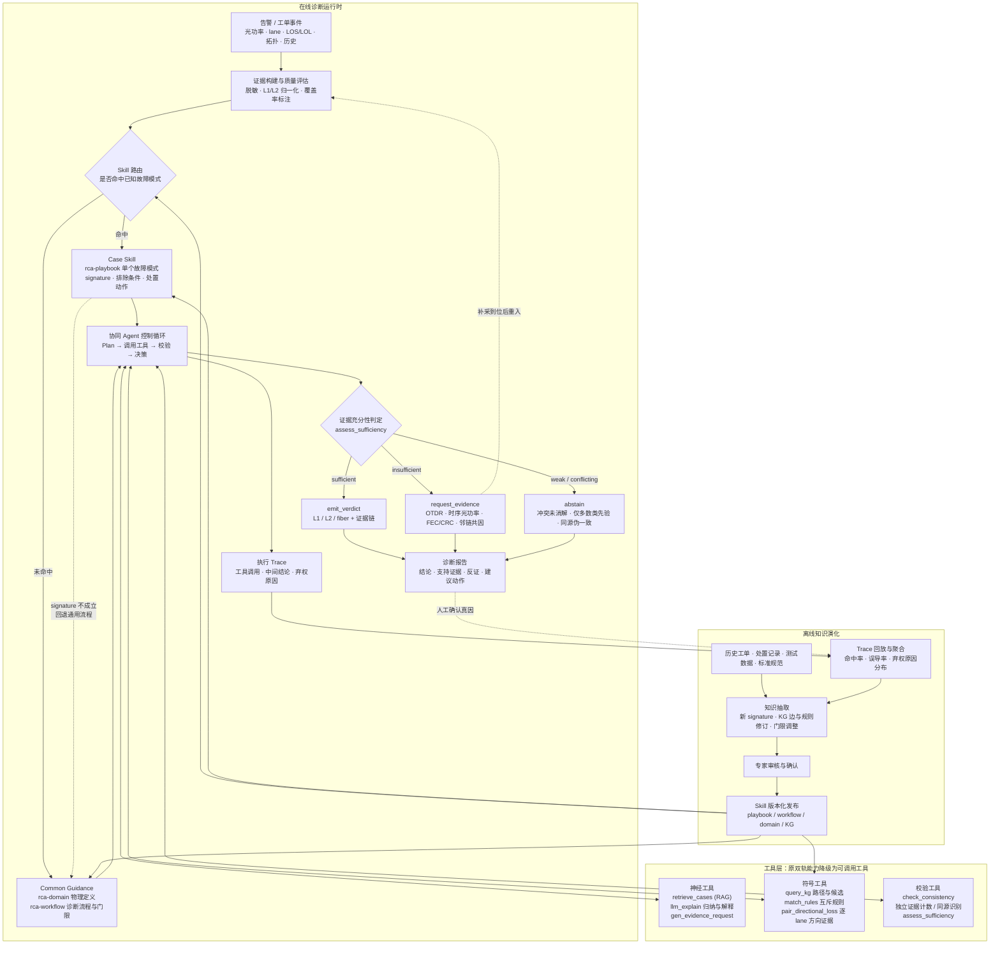
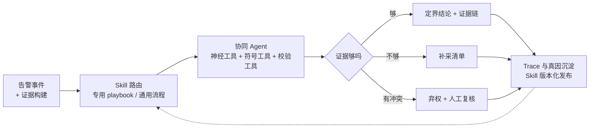

# 光链路 RCA 统一框架图（Skill 化 Agent + 神经符号工具）

本文把三份来源融合成一张主框架图：

- 原始 RCA v2 框架图：离线知识沉淀 + 在线神经/符号双轨推理 + 协同模块 + 反馈闭环。
- Skill 化 Agent 探索图：在线诊断运行时（Case Skill / Common Guidance 路由）+ 离线 Skill 演化流水线。
- `docs/AGENT_RCA_DESIGN_CN.md`：单协同 Agent、工具层、证据充分性门控、弃权与主动补证据。

融合的核心判断是：**双轨推理不再是两个并列的分类器，而是同一个 Agent 的两组工具；Skill 路由决定 Agent 用哪套知识；证据充分性决定 Agent 是否有资格给出三分类。**

## 1. 主框架图

## 2. 三张图的对应关系

| 原图元素 | 在新框架中的位置 |
| --- | --- |
| 图2 离线 KG 构建与专家审核 | 离线知识演化的一部分，KG 与规则作为 Skill 的结构化载体一起发布 |
| 图2 神经层 LLM 推理 | 工具层的 `retrieve_cases` / `llm_explain` / `gen_evidence_request` |
| 图2 符号层 KG 推理 | 工具层的 `query_kg` / `match_rules` / `pair_directional_loss` |
| 图2 协同模块的一致性校验与冲突仲裁 | 工具层 `check_consistency` + Agent 控制循环，不再是独立融合器 |
| 图2 反馈学习闭环 | Trace 回放与聚合 → 知识抽取 → 专家审核 → Skill 发布 |
| 图1 Case / Guidance 路由 | Skill 路由，Case Skill 对应 `rca-playbook`，Common Guidance 对应 `rca-domain` + `rca-workflow` |
| 图1 Diagnosis Found? 的重路由 | 保留为 Case Skill 回退 Common Guidance 的虚线 |
| 图1 Skill Execution Agent | 单协同 Agent 控制循环 |
| 图1 Execution Trace + Trace Replay | 在线 Trace 输出与离线回放聚合 |

## 3. 相对两张原图的三个关键改动

**第一，二态出口改成三态出口。** 图1 只有“找到诊断 / 回退通用流程”两种走向，最终仍会给出一个结论。结合缺陷分析（21/85 测试 case 提取不到任何异常、`fiber` recall 为 0），新框架在 Agent 之后加了显式的证据充分性门控，出口是 `verdict`、`request_evidence`、`abstain` 三选一。这是整张图里最重要的改动。

**第二，双轨从并列推理降级为工具。** 图2 把神经层和符号层画成两条等宽的推理链，再用协同模块融合。但两条链共享同一组 anomaly id，一致性往往是同源一致而非独立确认。新框架把它们放进工具层，由 `check_consistency` 显式区分 `consistent` 和 `same_source_agreement`，并统计独立证据数。

**第三，知识沉淀从“进训练集”改成“进 Skill”。** 图2 的知识回灌指向 KG，图1 的离线流水线指向 Skill 包。新框架合并为一条通路：Trace 与人工确认真因先聚合、抽取 signature、专家审核，再版本化发布为 playbook / workflow 门限 / KG 边。`fiber` 只有 8 条训练样本，走 playbook 比走统计模型更稳。

## 4. 可选的简化版（对外汇报用）

如果主图信息量偏大，可以用这张四段式简化图：

## 5. 与评估协议的衔接

新框架图的价值主张必须落到 `docs/AGENT_RCA_DESIGN_CN.md` 里的评估口径上，否则图会显得只是重新排版：

- 图中的三态出口对应覆盖率-精度曲线，而不是单一 accuracy。
- 图中的 `request_evidence` 对应证据请求质量的人工评分。
- 图中的 Case Skill 回退虚线对应 playbook 命中率与误导率统计。
- 图中的 `check_consistency` 对应独立证据数，用来解释为什么当前双轨一致却没有带来增益。
